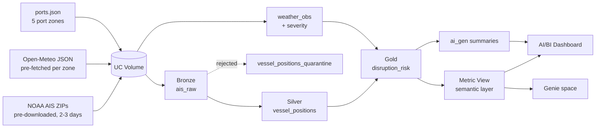

# Architecture — Supply Chain Disruption Intelligence

<!-- Type: Explanation -->

- **Status:** Live (POC)
- **Last reviewed:** 2026-09-02
- **Owner:** Builder Launchpad team

This POC flags maritime supply-chain disruption by combining NOAA AIS vessel
movements with Open-Meteo weather, scoring a rule-based disruption risk per
vessel and port zone, and surfacing it through an AI/BI dashboard and a Genie
natural-language layer on Databricks Free Edition.

## Design principle

All transform and scoring logic lives in a pure, framework-free Python package
(`src/scdi/`) that runs and unit-tests locally. The Databricks notebooks are
thin wrappers that read from a Unity Catalog Volume and persist Delta tables.
This keeps the risk model testable off-platform and makes the notebooks trivial
to review. See [ADR-002](ADR-002-rule-based-scoring-mvp.md).

## Data flow



## Layers

| Layer | Asset | Contents |
|---|---|---|
| Bronze | `ais_raw` | Raw AIS rows as ingested, with provenance columns |
| Silver | `vessel_positions` | Clean, de-duplicated positions with `port_zone` + `is_slow` |
| Silver | `vessel_positions_quarantine` | Rejected rows with `quarantine_reason` |
| Reference | `weather_obs` | Per-zone hourly weather with `[0,1]` severity |
| Gold | `disruption_risk` | One row per vessel×zone×window with score, band, top factor, reasoning, breakdown, action, summary |
| Semantic | Metric View | Measures and dimensions the dashboard and Genie share |

## Risk model

The delay score is a **configurable factor model** — data, not code — chosen for
explainability and tunability ([ADR-004](ADR-004-configurable-factor-model.md)).
`src/scdi/factors.yml` declares the factors; `scdi.factors.evaluate` applies them:

```
delay_score = sum(weight * contribution[0..1]) for each declared factor, capped at 100

default factors:  slowdown (40) + weather (40) + port-proximity (20)
risk_band:        high (>= 60) · medium (30-59) · low (< 30)
```

Each Gold row also carries its `top_factor`, a human `reasoning` string
(e.g. *"Severe marine weather (40); Vessel slowdown near port (35.6)"*), and the
full `factor_breakdown` as JSON. A vessel outside every port zone scores zero —
open-water transit is out of scope. Weights, thresholds, bands, actions and the
per-factor reasons are all editable in `factors.yml`; weather-severity buckets
(wind / gust / precipitation / wave) live in `src/scdi/constants.py`.

## GenAI layer

Two surfaces, both on the Gold table / Metric View:

1. **Behind the scenes and in the data:** `notebooks/40_genie_summaries.sql`
   uses the `ai_gen` SQL function to turn each Gold row's structured fields into
   an operator narrative. A deterministic template (`scdi.narrative`) is written
   first, so the experience degrades gracefully if AI functions are unavailable
   in Free Edition.
2. **User-facing:** a Genie space (`genie/instructions.md`) answers natural-
   language questions with curated instructions, synonyms and trusted SQL.

## How it maps to the Builder Launchpad tiers

| Tier | Deliverable here |
|---|---|
| Tier 0 — Data Foundation | Medallion pipeline + quarantine + assumptions (README) |
| Tier 1 — AI/BI Dashboard | `dashboards/` on the Metric View, with a risk-band filter |
| Tier 2 — Genie Space | `genie/instructions.md` on the same semantic layer |
| Tier 3 — App (bonus) | Out of scope by choice ([ADR-001](ADR-001-free-edition-dashboard-first.md)) |

## Constraints and risks

Databricks Free Edition is serverless-only, quota-limited, and restricts
outbound internet to trusted domains. The pipeline therefore never calls the
internet at runtime — AIS and weather are pre-staged into a Volume
([ADR-003](ADR-003-batch-predownloaded-data.md)). The bundled sample data is
synthetic but schema-accurate, so the repo is self-contained and deterministic.
